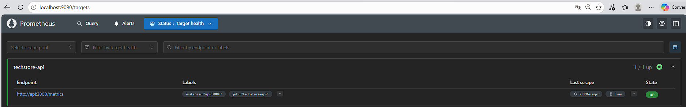
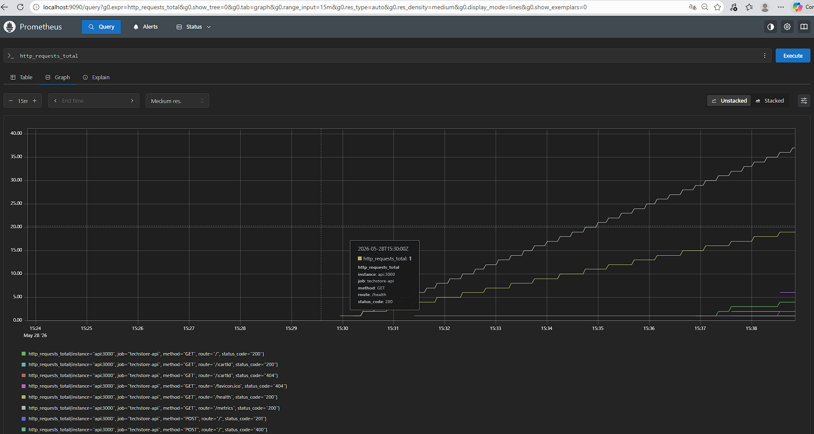
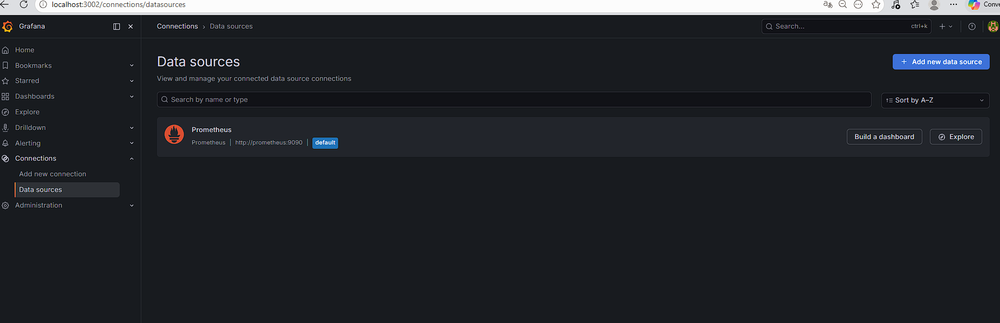
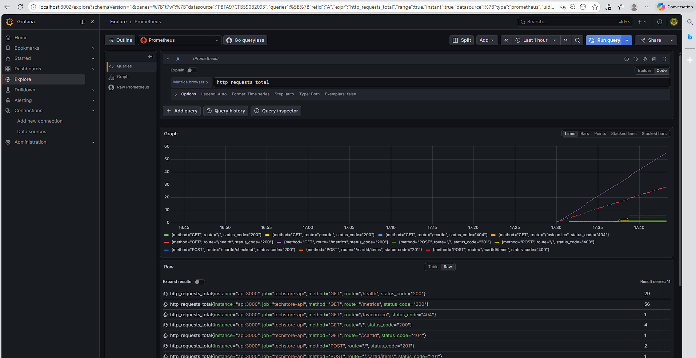

# TechStore.io — API e-commerce CI/CD

[](https://github.com/mandarasoloson/project_CICD/actions/workflows/ci.yml)
[](https://sonarcloud.io/project/overview?id=mandarasoloson_project_CICD)
[](https://sonarcloud.io/project/overview?id=mandarasoloson_project_CICD)

Projet individuel M1 Full Stack — CI/CD & DevOps.
Application e-commerce (catalogue, panier, checkout) construite autour d'une architecture propre et d'un pipeline CI/CD complet.

---

## Stack technique

| Couche | Technologie | Justification |
|--------|-------------|---------------|
| Langage | TypeScript (strict) | Typage fort, détection d'erreurs à la compilation |
| Runtime | Node.js 24 + Express 5 | Léger, adapté aux API REST |
| Tests unitaires | Jest + ts-jest | Standard Node.js, AAA natif |
| Tests intégration | Supertest | Teste les routes HTTP sans serveur externe |
| Tests E2E | Playwright | Simule un vrai navigateur, stable et rapide |
| Lint | ESLint + Prettier | Qualité et style automatiques |
| CI/CD | GitHub Actions | Gratuit, natif GitHub, parallélisme natif |
| Conteneurisation | Docker multi-stage Alpine | Image légère < 200MB, non-root |
| IaC | Terraform (provider Docker) | Infrastructure versionnée et reproductible |
| Monitoring | Prometheus + Grafana | Métriques temps réel et alertes |
| Analyse statique | SonarCloud | Quality Gate bloquante sur les PRs |
| Sécurité | Trivy + Dependabot | Scan CVE image + surveillance dépendances |

---

## Architecture de l'application

```
src/
├── domain/              # Logique métier pure (sans Express)
│   ├── cart.service.ts        # Pattern Observer
│   ├── cart-observer.ts       # StockUpdater, OrderLogger
│   ├── product.factory.ts     # Pattern Factory
│   ├── product.service.ts
│   ├── order.service.ts
│   ├── pricing.strategy.ts    # Pattern Strategy (VIP / Standard)
│   ├── *.repository.ts        # Pattern Repository
│   └── logger.ts              # Pattern Singleton
├── routes/              # Binding HTTP uniquement
│   ├── cart.routes.ts
│   ├── product.routes.ts
│   └── order.routes.ts
├── utils/
│   └── metrics.ts       # Exposition Prometheus
└── app.ts               # Composition de l'application
```

### Design Patterns implémentés

| Pattern | Fichier | Problème résolu |
|---------|---------|-----------------|
| **Factory** | `product.factory.ts` | Création de produits physiques/digitaux sans `new` dans les routes |
| **Strategy** | `pricing.strategy.ts` | Calcul du prix VIP ou standard interchangeable à l'exécution |
| **Repository** | `*.repository.ts` | Abstraction de la couche données — swap BDD sans toucher au domaine |
| **Singleton** | `logger.ts` | Instance unique du logger partagée dans toute l'app |
| **Observer** | `cart-observer.ts` | Décrémentation du stock + log de commande sans couplage à CartService |

---

## Pipeline CI/CD

```
Push / PR
    │
    ├──► Lint & Format       (ESLint + tsc --noEmit)
    │
    ├──► Run Tests           (Jest, coverage ≥ 80%, rapport lcov)
    │         │
    │         └──► SonarCloud Analysis  (Quality Gate bloquante)
    │
    ├──► Trivy deps          (scan CVE dépendances npm)
    │
    └──► Build & Scan Docker (build image + Trivy CVE image)
              │
              └──► Push GHCR (main uniquement)
                   ghcr.io/mandarasoloson/project_cicd:latest
```

---

## Lancer le projet

### Prérequis
- Docker Desktop installé et lancé

### Démarrage complet (API + Prometheus + Grafana)

```bash
docker compose up --build
```

| Service | URL | Credentials |
|---------|-----|-------------|
| Application | http://localhost:3000 | — |
| Métriques | http://localhost:3000/metrics | — |
| Prometheus | http://localhost:9090 | — |
| Grafana | http://localhost:3002 | admin / admin |

### Variables d'environnement

Copier `.env.example` en `.env` et ajuster si besoin :

```bash
cp .env.example .env
```

| Variable | Défaut | Description |
|----------|--------|-------------|
| `NODE_ENV` | `production` | Environnement Node.js |
| `PORT` | `3000` | Port d'écoute de l'API |

---

## Lancer les tests

```bash
# Tests unitaires + intégration (avec rapport de coverage)
npm run test:cov

# Tests E2E Playwright (nécessite un serveur sur :3000)
npx playwright test --project=chromium
```

---

## Infrastructure as Code (Terraform)

Le dossier `terraform/` définit l'infrastructure via le provider Docker :
- Réseau Docker dédié
- Image depuis GHCR
- Conteneur avec healthcheck et variables d'environnement

```bash
cd terraform
terraform init
terraform plan    # preview des changements
terraform apply   # déploiement réel
terraform destroy # suppression
```

> En production, on utiliserait le provider AWS/Azure avec un backend S3 pour le state file.

---

## Monitoring

### Architecture

```
API (:3000/metrics) ←── Prometheus (:9090) ──→ Grafana (:3002)
```

### Screenshots

**Prometheus — API scrapée (UP)**


**Prometheus — Métriques HTTP en temps réel**


**Grafana — Datasource Prometheus auto-configurée**


**Grafana — Exploration des métriques**


### Alertes configurées

| Alerte | Condition | Sévérité |
|--------|-----------|----------|
| AppDown | API inaccessible > 30s | Critical |
| HighErrorRate | Taux erreurs 5xx > 10% sur 5m | Warning |
| SlowResponseTime | P95 temps de réponse > 1s sur 2m | Warning |

---

## Stratégie de rollback

En cas de problème après un déploiement :

**1. Rollback via Docker (immédiat)**
```bash
# Redéployer un tag précédent depuis GHCR
docker pull ghcr.io/mandarasoloson/project_cicd:<SHA_PRECEDENT>
docker stop techstore-api
docker run -p 3000:3000 ghcr.io/mandarasoloson/project_cicd:<SHA_PRECEDENT>
```

**2. Rollback via Git**
```bash
# Identifier le commit stable
git log --oneline

# Créer une branche de revert
git revert <commit_hash>
git push origin main
# Le pipeline CD redéploie automatiquement l'image
```

Chaque image Docker est taguée avec le SHA du commit (`ghcr.io/.../project_cicd:<SHA>`), ce qui permet de revenir précisément à n'importe quel état.

---

## Qualité du code

- **SonarCloud** : Quality Gate bloquante — 0 bugs, 0 vulnérabilités, duplication < 3%
- **Trivy** : Scan CVE sur les dépendances npm ET l'image Docker à chaque PR
- **Dependabot** : Surveillance hebdomadaire des dépendances npm et GitHub Actions
- **Coverage** : Seuil bloquant à 80% (statements, functions, lines) et 70% (branches)
- **Pre-commit hooks** : Husky + lint-staged + commitlint (Conventional Commits)
